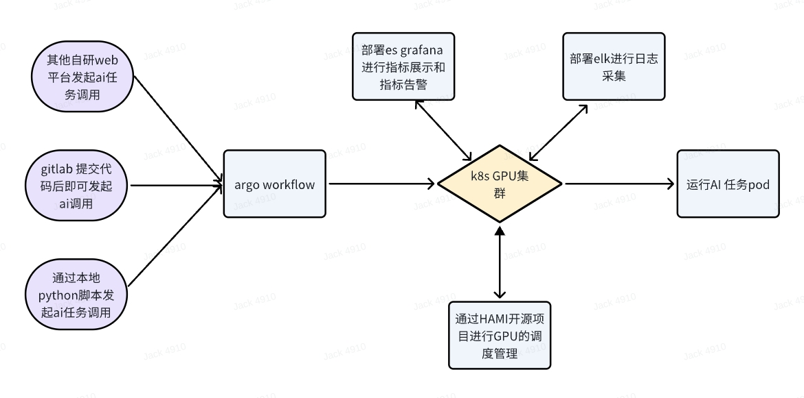
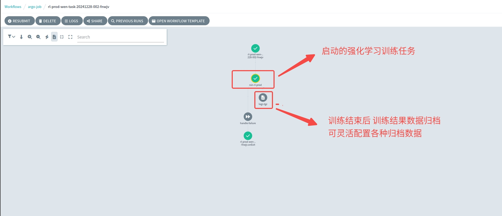

# AI计算平台一站式保姆级搭建指南

本项目提供了高可用k8s集群搭建样例指引 argo workflow搭建样例指引 gitlab私有仓库部署详细指引  gitlab runner部署详细指引 gitlab cicd 流水线yaml文件编写指引详细指引， argo workflow模版编写样例指引， AI任务docker基础镜像构建指引样例。可为AI用户提供端到端的AI计算平台搭建指南和AI任务容器化的具体样例参考。完成本项目搭建后，AI开发者只需更改代码提交到gitlab 即可自动发起对应的AI任务，极大的提升了AI开发效率。

<div align="center">

### 本项目架构图



</div>


## 高可用k8s集群搭建指南

在开源项目kubespray（https://kubespray.io）的基础上 做了如下三方面优化改造：
1. 增加了节点初始化ansible自动化脚本 根据多年k8s集群运维管理经验优化了k8s节点初始化参数,如关闭apt自动更新，关闭swap,设置统一的ntp时间源，更改文件句柄数, 关闭节点内核自动更新，关闭ipv6,开启内核coredump，优化ipvs内核参数，优化网络内核参数等 详细可参考:[k8s节点初始化ansible脚本](./k8s-deploy/playbooks/roles/initial-kube-node/tasks/main.yml); 
2. 预优化调整了各种k8s参数的初始配置：如etcd 独立部署，etcd event事件拆分， api-server同时处理请求参数优化， k8s证书自动更新优化，k8s节点内存软硬驱逐优化设置，k8s节点硬盘软硬驱逐阈值设置更新，k8s节点镜像自动清理相关参数优化等；
3. 打包k8s集群各个组件软件包为一个完整的[release安装包](8.141.22.226:8009/releases.tar.gz),且支持一键式缓存到本地，无需翻墙下载安装包，更改了k8s集群所有组件镜像地址为[阿里云镜像仓库](./k8s-deploy/scripts/pull_docker.yml)，使得在国内网络环境下10分钟内能够快速搭建一套高可用k8s集群.

k8s集群部署详细指引:
  - [README](./k8s-deploy/README.md)


## GPU 调度器搭建指南

1. 若GPU节点的GPU显卡无需再次虚拟化，一张显卡只跑一个任务，则可以直接使用nvidia官网提供的k8s device plugin 进行GPU资源的调度，详细可参考[官方文档](https://gitlab.com/nvidia/kubernetes/device-plugin)；

2. 若GPU节点的GPU显卡需要虚拟化，即单张显卡跑多个任务，可以考虑如下的几个GPU共享调度器的方案：
   - 方案一：腾讯云的gpu-manager方案，详细可参考[gpu-manager项目](https://github.com/tkestack/gpu-manager)；
   - 方案二：阿里云的gpushare方案，详细可参考[gpushare项目](https://github.com/AliyunContainerService/gpushare-scheduler-extender)；
   - 方案三：volcano开源团队出品的k8s-vGPU-scheduler方案，详细可参考[k8s-vGPU-scheduler项目](https://github.com/Project-HAMi/HAMi)；

3.  实际项目中可优先考虑GPU虚拟化方案（可灵活配置一张显卡仅跑一个任务或多个任务），经过测试volcano开源团队出品的k8s-vGPU-scheduler方案 部署简单，且稳定性高，适合大规模集群的GPU共享调度。
具体配置可参考如下链接文档:
GPU共享插件部署：
https://docs.ucloud.cn/uk8s/administercluster/gpu-share
GPU监控组件安装：
https://docs.ucloud.cn/uk8s/administercluster/gpu-monitor


## k8s ELK日志系统 prometheus grafana监控系统 ingress搭建指南

1. k8s ELK日志系统可参考[readme](./k8s-monitoring-deploy/elastic_search/README.md);

2. k8s prometheus grafana 监控系统可参考[readme](./k8s-monitoring-deploy/prometheus/README.md);

3. k8s ingress 部署可参考[readme](./k8s-ingress-deploy/README.md);


## argo workflow搭建指南

argo workflow 是 kubernetes 原生的工作流控制器，可以实现复杂的工作流调度，本项目提供了 argo workflow 样例，详细可参考[argo 官网文档](https://argo-workflows.readthedocs.io/en/latest/installation/)。

```shell
helm repo add argo https://argoproj.github.io/argo-helm     # 添加 argo 仓库
helm repo update   
helm search repo argo/argo-workflows -l    # 查找 argo 版本
helm show values argo/argo-workflows --version 0.42.7 > values.yaml   #  本安装样例是基于 argo 0.42.7 版本 可以导出此版本的 values.yaml 文件进行修改

# 部署 argo workflow
export NAMESPACE=argo
helm -n ${NAMESPACE} upgrade --install argo-workflows -f values.yaml \
--version 0.42.7 argo/argo-workflows
```

本项目argo workflow [values.yaml 样例文件](./argo-workflow-deploy/values.yaml)

argo workflow 模版编写官网文档参考： https://argo-workflows.readthedocs.io/en/latest/walk-through/scripts-and-results/
通过argo workflow模版能够实现各种AI计算的工作流调度，如模型训练、模型评估、模型部署等，详细可参考[强化学习训练的argo workflow模版编写样例](./argo-workflow-deploy/rl-prod.yml)。

根据实际业务场景编写完 argo workflow 模版后 即可通过argo 原生的api接口通过各种方式发起AI任务调用（比如 gitlab 流水线或自研AI web平台等），argo 原生api 接口：https://argo-workflows.readthedocs.io/en/latest/swagger/


<div align="center">

通过gitlab cicd流水线调用argo强化学习训练任务样例



</div>


## gitlab 私有仓库部署指引

安装gitlab 私有仓库 可通过 Linux安装包 云原生 Docker 三种方式部署安装，建议通过Linux安装包方式部署安装 gitlab 私有仓库，详细可参考[gitlab官方文档](https://gitlab.cn/docs/omnibus/)。

ubuntu 20.04 安装 gitlab 私有仓库步骤(建议私有仓库服务器最低配置为4c8g)
```shell
sudo apt-get update
sudo apt-get install -y curl openssh-server ca-certificates tzdata perl
sudo apt-get install -y postfix
curl -L get.gitlab.cn | bash
sudo EXTERNAL_URL="https://gitlab.example.com" apt-get install -y gitlab-jh
需要立即更改下初始密码:
使用第二步 EXTERNAL_URL 中配置的地址来访问安装成功的极狐GitLab 实例。用户名默认为 root 。如果在安装过程中指定了初始密码，则用初始密码登录，如果未指定密码，
则系统会随机生成一个密码并存储在 /etc/gitlab/initial_root_password 文件中， 查看随机密码并使用 root 用户名登录。
注意：出于安全原因，24 小时后，/etc/gitlab/initial_root_password 会被第一次 gitlab-ctl reconfigure 自动删除，因此若使用随机密码登录，建议安装成功初始登录成功之后，立即修改初始密码

修改/etc/gitlab/gitlab.rb文件中的external_url参数为期望的访问地址。一般分为极狐GitLab所在主机的IP地址
# 例如 external_url 'http://8.141.22.226'
external_url 'http://<YOUR_IP_ADDRESS>'


使得修改的配置生效
gitlab-ctl reconfigure
登录gitlab后台更改密码  且激活license
gitlab-ctl restart 来重启服务
```

部署完成后，可在服务器上创建如下定时任务备份gitlab仓库数据
```shell
# 备份gitlab配置数据
15 04 * * 2-6  gitlab-ctl backup-etc
0 2 * * * find /etc/gitlab/config_backup -type f -mtime +7 -exec rm -f {} \;
# 备份gitlab仓库数据
0 2 * * * /opt/gitlab/bin/gitlab-backup create CRON=1
0 3 * * * find /var/opt/gitlab/backups -type f -mtime +5 -exec rm -f {} \;
0 2 * * * find /var/log/ -type f -mtime +20 -exec rm -f {} \;
```

gitlab仓库数据通过备份恢复可参考[gitlab官方文档](https://gitlab.cn/docs/jh/raketasks/backup_restore.html)


## gitlab runner部署详细指引

gitlab runner 是gitlab 官方提供的CI/CD任务自动化执行器，可用于执行CI/CD任务，本项目提供了gitlab runner 样例，详细可参考[gitlab runner 官网文档](https://gitlab.cn/docs/runner/install/kubernetes.html)。

如下是通过helm安装gitlab runner的一个样例步骤：
```shell
helm repo add gitlab-jh https://charts.gitlab.cn
helm search repo -l gitlab-jh/gitlab-runner
helm repo update gitlab-jh
helm --namespace rl-cicd upgrade --install rl-gitlab-runner -f rl_values.yaml --version 0.70.3 gitlab-jh/gitlab-runner
```

[本样例中runner helm values文件rl_values.yaml 文件](./k8s-gitlab-runner-deploy/rl_values.yaml)


## gitlab cicd 流水线yaml文件编写指引
gitlab cicd 流水线是gitlab 官方提供的CI/CD任务流水线，可用于编排CI/CD任务，详细可参考[gitlab cicd 流水线yaml文件编写官网指引](https://gitlab.cn/docs/jh/ci/yaml/gitlab_ci_yaml.html)。
通过编写gitlab cicd 流水线yaml文件，可非常容易的实现提交训练代码更改到私有仓库后即触发AI训练任务，极大提高AI开发效率。
另外也可参考我的另外一个开源项目包括了各种gitlab cicd流水线yaml文件编写样例，可供参考：[gitlab-ci-demo项目](https://gitee.com/zhichneghe/gitlab-ci-demo)


<div align="center">

### 对本项目有任何疑问或建议，欢迎联系探讨，微信号：h285426134


</div>
